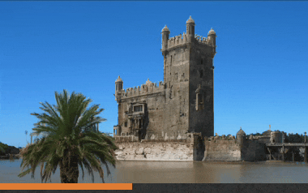
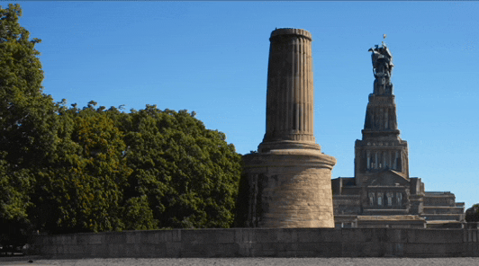

# mitt-foto-album 
Jeg har lagd en nettside for feriebildene mine. 🏖️

## TODO (oppgave 4):
* Få styling til å funke 😎
* Vise mine tre favorittbilder 🏞️
* Linke til bildekarusellen 🎞️

## Backlogg (oppgave 6):
* Fikse bildekarusellen 📸
    * Den skal vise ett og ett bilde om gangen fra mappen "bilder" 📂
    * Den skal gå til neste bilde hvert 5. sekund ⏲️
    * Man skal kunne trykke på frem og tilbake piler med musen for å gå til neste og forrige bilde ⏭️

## Bonus:
Jeg ønsker meg en mer dynamisk bildekarusell, legg til noe animasjon. Her er noen forslag på hva jeg kunne tenkt meg:

